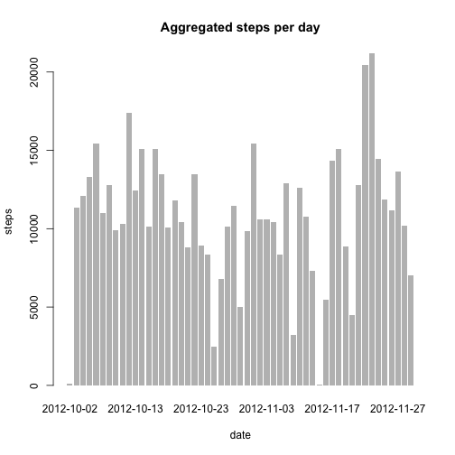
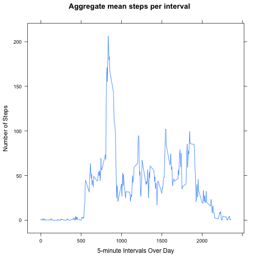
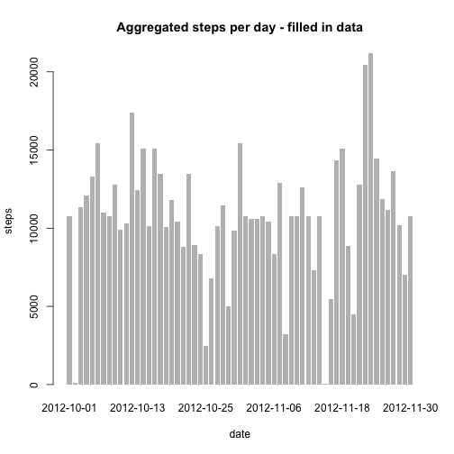
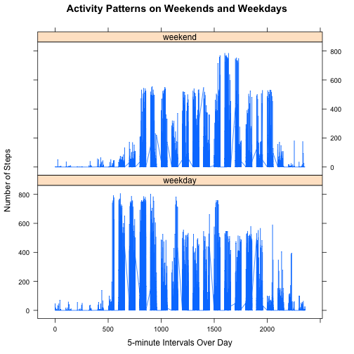

Reproducible Data Peer Assignment 1
=======================================================

This is the step by step resolution of the peer assignament #1 for the Reproducible Research course.  The assignament consists on loading, manipulating and interpreting a set of activity data generated by an activity tracker. 

The original dataset contains 3 variables
- an identifyer for the 5 minute interval in which steps where recorded
- the number of steps recorded during that interval
- the date in which the steps where recorded

## Data loading and preprocessing

Loading and summarizing the data


```r
# this assumes the data is already unzipped in the same directory
activity <- read.csv("activity.csv")
summary(activity)
```

```
##      steps               date          interval   
##  Min.   :  0.0   2012-10-01:  288   Min.   :   0  
##  1st Qu.:  0.0   2012-10-02:  288   1st Qu.: 589  
##  Median :  0.0   2012-10-03:  288   Median :1178  
##  Mean   : 37.4   2012-10-04:  288   Mean   :1178  
##  3rd Qu.: 12.0   2012-10-05:  288   3rd Qu.:1766  
##  Max.   :806.0   2012-10-06:  288   Max.   :2355  
##  NA's   :2304    (Other)   :15840
```

```r
str(activity)
```

```
## 'data.frame':	17568 obs. of  3 variables:
##  $ steps   : int  NA NA NA NA NA NA NA NA NA NA ...
##  $ date    : Factor w/ 61 levels "2012-10-01","2012-10-02",..: 1 1 1 1 1 1 1 1 1 1 ...
##  $ interval: int  0 5 10 15 20 25 30 35 40 45 ...
```


Changing the date column to date format


```r
library(lubridate)
activity$date <- ymd(activity$date)
```


## What is mean total number of steps taken per day?

First I created a data frame to aggregate steps per day


```r
aggsteps <- aggregate(steps ~ date, data = activity, FUN = sum)
```


This histogram shows the aggregated number of steps per day in the original data set


```r
barplot(aggsteps$steps, names.arg = aggsteps$date, border = NA, main = "Aggregated steps per day", 
    xlab = "date", ylab = "steps")
```

 


This calculates the mean and the median steps for the original data set, ignoring NA's


```r
meansteps <- mean(aggsteps$steps)
mediansteps <- median(aggsteps$steps)
```


The mean is **1.0766 &times; 10<sup>4</sup>** and the median is **10765**.

## What is the average daily activity pattern?

The following is a time series plot of the 5-minute interval and the average number of steps taken, averaged across all days. 


```r
# aggregate mean steps per interval
intersteps <- aggregate(activity$steps, by = list(interval = activity$interval), 
    FUN = mean, na.rm = T)
colnames(intersteps) <- c("interval", "steps")
# create the plot
library(lattice)
xyplot(steps ~ interval, data = intersteps, type = "l", xlab = "5-minute Intervals Over Day", 
    ylab = "Number of Steps", main = "Aggregate mean steps per interval")
```

 


Determining the interval with the maximun number of steps in the time series


```r
max <- intersteps$interval[which.max(intersteps$steps)]
```


The interval with the maximun number of steps is **835** 

## Inputing missing values

Calculate and report the total number of missing values in the dataset 


```r
totalna <- sum(is.na(activity))
totalna
```

```
## [1] 2304
```


For filling in all of the missing values in the dataset I decided to use the mean of the steps of other intervals observed in the same day. Here's the code for adding the missing values:


```r
activity <- merge(activity, intersteps, by = "interval", suffixes = c("", ".y"))
nas <- is.na(activity$steps)
activity$steps[nas] <- activity$steps.y[nas]
activity <- activity[, c(1:3)]
```


This is a histogram of the total number of steps taken each day and a report of the mean and median total number of steps taken per day


```r
aggsteps2 <- aggregate(steps ~ date, data = activity, FUN = sum)
barplot(aggsteps2$steps, names.arg = aggsteps2$date, border = NA, main = "Aggregated steps per day - filled in data", 
    xlab = "date", ylab = "steps")
```

 

```r
# calculate mean and median
newmean <- mean(aggsteps2$steps)
newmedian <- median(aggsteps2$steps)
```


These values don't differ significantly from the estimates from the first part of the assignment. The impact of imputing missing data on the estimates of the total daily number of steps does not make a major difference on the numbers. The new mean is **1.0766 &times; 10<sup>4</sup>** and the new median is **1.0766 &times; 10<sup>4</sup>**


## Differences in activity patterns between weekends and weekdays

The first step is to add weekday/weekend as factor for the different days


```r
daytype <- function(date) {
    if (weekdays(as.Date(date)) %in% c("Saturday", "Sunday")) {
        "weekend"
    } else {
        "weekday"
    }
}
# add the data to the dataset
activity$daytype <- as.factor(sapply(activity$date, daytype))
```


Now it is possible to plot the differences between weekend and weekday data


```r
library(lattice)
xyplot(steps ~ interval | daytype, data = activity, layout = c(1, 2), type = "l", 
    xlab = "5-minute Intervals Over Day", ylab = "Number of Steps", main = "Activity Patterns on Weekends and Weekdays")
```

 


From the plot you could say weekdays are a bit more uniform and the activity is a bit higher towards the earlier segments.


